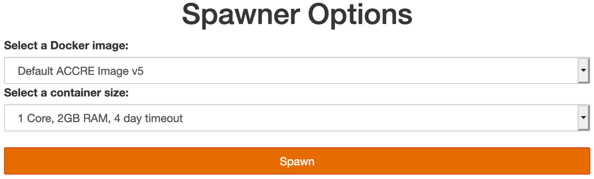
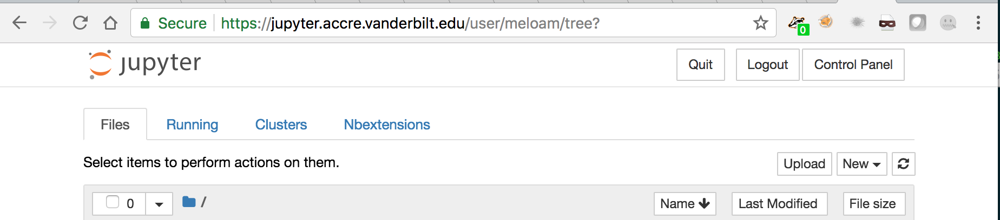

# Jet CMS HATS Exercise
(also used for the LPC CMS DAS)

## LPC HATS 2020
<summary>Directions for HATS June 2020</summary>
  
### Introduction
This Hands on Advanced Tutorial Session (HATS) is intended to provide you with basic familiarity with jet energy corrections (JEC) as they relate to CMS. Pretty much all analyses which use jets will need to make use of JECs in some way. Additionally, analyses will probably use the systematic uncertainties for those corrections as well as the jet energy resolution (JER) scale factors and their uncertainties. A general description of the JEC and JER will be provided, as well as several example of how to apply these corrections/scale factors.

More details about pileup and its removal from jets will be given as pileup presents a large issue for current and future analyses. There are several ways to mitigate the effects of pileup and this tutorial will cover the most common of those methods.

### Getting Started (Setup)
This tutorial uses Jupyter Notebooks as a browser-based development environment at Vanderbilt. These Jupyter-based tutorials use a pre-configured Jupyter service usable by all CMS members.

#### Connect to Jupyter 
To log in, access the [login](https://jupyter.accre.vanderbilt.edu/) page and login using your CERN credentials. You will then need to choose a Docker image an container size.



You want to choose `Default ACCRE Image v5` for the image and `1 Core, 2GB RAM, 4 day timeout` for the size. Once the container has been spawned, you should see the following front page



The two most important buttons are
  * The `new` button, which lets you open a terminal or start a new Jupyter notebook.
  * The `control panel` button, which lets you shut down your notebook once you're done. It's helpful to do this to free up resources for other users.

#### Upload Grid Certificates
We will copy your grid certificate from a cluster where you presumably already have it installed (i.e. cmslpc, lxplus, etc.). If you've already done this recently, there is not need to do it again. The only time you need to copy it over is if you've never done it before or if you've received a new grid certificate and the old one has expired.

To begin, open the front page (shown above), and click the `New` box at the top right, then the `Terminal` option. This will open a new tab with a bash terminal. Execute the following commands (following the appropriate prompts) to copy your certificate to the Vanderbilt ACCRE cluster (**note**: replace `username` with your `FNAL` username!):

##### From CMSLPC
The following command will prompt you for your FNAL Kerberos password:
```bash
kinit username@FNAL.GOV
rsync -rLv username@cmslpc-sl7.fnal.gov:.globus/ ~/.globus/
chmod 755 ~/.globus
chmod 600 ~/.globus/*
kdestroy
```

##### From LXPLUS
The following command will prompt you for your LXPLUS password:
```bash
rsync -rLv username@lxplus.cern.ch:.globus/ ~/.globus/
chmod 755 ~/.globus
chmod 600 ~/.globus/*
```

#### Initialize Your Proxy at every Login!
If you have a password on your grid certificate, you'll need to remember to execute the following in a terminal *each time you log in to Jupyter*. Similar to the LPC/LXPLUS clusters, you will get a new host at each logon, and the new host won't have your old credentials.

Each time you log in, open a terminal and execute:
```bash
voms-proxy-init -voms cms -valid 192:00
```

#### Checkout the code
Open up a new terminal. If you are worried about this exercise clashing with the other code you have on the ACCRE cluster, you can always make a new directory and place all of the code in there. For example:
```bash
mkdir Jets1HATS2020
cd Jets1HATS2020
```

Wherever you decide to place the code, run the following command:
```
mkdir JMEHATS2020
cd JMEHATS2020
wget https://raw.githubusercontent.com/cms-jet/JMEDAS/HATS2020/setup-libraries.ipynb
```

Go back to your Jupyter browser (Home) page, navigate to wherever you downloaded the setup-libraries notebook (i.e. `Jets1HATS2020`), and open the newly downloaded notebook  (`setup-libraries.ipynb` - downloaded just recently - only one cell to run). This will checkout the code and setup your environment for future use. After running setup-libraries.ipynb, choose "File... Close and Halt". Then you can continue on to the Tutorial section (below).

Note: If you'd like to set this code up to be used without Jupyter, follow the directions below. This is not necessary for the DAS or HATS exercises.
<details>
<summary>Standalone directions without Jupyter</summary>
  
  ```bash
  export SCRAM_ARCH=slc7_amd64_gcc700
  cmsrel CMSSW_10_6_13
  cd CMSSW_10_6_13/src
  cmsenv
  git clone https://github.com/cms-jet/JMEDAS.git Analysis/JMEDAS -b HATS2020
  git clone https://github.com/cms-jet/JetToolbox Analysis/JetToolbox -b jetToolbox_102X
  cd Analysis/JMEDAS
  scram b -j 4
  cd test
  voms-proxy-init
  ```
</details>
  
### Tutorial
Once you've completed the setup instructions, change to the directory `~/Jets1HATS2020/CMSSW_10_6_13/src/Analysis/JMEDAS`. Information on the separate tutorials can be found in the "notebooks" subdirectory.

### Notes for working on ACCRE

  1. Please remember to close and halt your notebooks when you're done with them. While it's possible to have multiple notebooks open, this can sometimes cause issues with a lack of memory and kernels becoming unstable. The best practice is to close the notebooks you aren't using. The notebook symbol will be green while it is in use and gray when it is shutdown.
  2. Remember to shutdown your server when your are done using it. Go to `Control Panel --> Stop My Server` when you are completely finished.

### FAQ

#### If someone updates the notebooks after I've cloned the repository, how do I get they updates?

In this case you will want to open a terminal, just as you did when you first cloned the repository. Move (`cd`) to the repository directory if not already there. Then do `git pull origin HATS2020`. This will pull the latest changes from GitHub. If you've already made edits to a notebook which will be updated, those changes will be conflict. You may want to stash those changes or copy your notebook.

#### I want to follow along on the LPC rather than ACCRE.

This is possible, but with a little less user support. You will need to use the following command to open up your ssh connection:
```bash
ssh -L localhost:8888:localhost:8888 <username>@cmslpc-sl7.fnal.gov
```
Replace `<username>` with your LPC username. You will need to have a CMSSW environment already setup as the LPC does not have Jupyter installed by default. You can use any CMSSW release. Then `cd` to the directory of your choice where you will clone the `setuo-libraries` notebook as before:
```bash
wget https://raw.githubusercontent.com/cms-jet/JMEDAS/HATS2020/setup-libraries.ipynb
```
Open Jupyter:
```bash
jupyter notebook --no-browser --port=8888 --ip 127.0.0.1
```
If everything worked, the last line of the output should be a url of the form:
```bash
http://127.0.0.1:8888/?token=<long string of numbers and letters>
```
Copy this url into your browser. You may now perform the rest of the exercise like normal, including by running the `setup-libraries.ipynb` notebook. This will install the CMSSW release used by the exercise. If you need to access Jupyter in the future, you can get it by doing a `cmsenv` within this release.

## Additional Information & Resources

  - [JERC Subgroup Twiki Page](https://twiki.cern.ch/twiki/bin/view/CMS/JetEnergyScale)
    - [JEC and JER Reference Sample Page](https://twiki.cern.ch/twiki/bin/view/CMS/JERCReference)
    - [WorkBook Page on Jet Energy Corrections](https://twiki.cern.ch/twiki/bin/view/CMSPublic/WorkBookJetEnergyCorrections?redirectedfrom=CMS.WorkBookJetEnergyCorrections)
    - [WorkBook Page on Jet Energy Resolution](https://twiki.cern.ch/twiki/bin/view/CMSPublic/WorkBookJetEnergyResolution)
  - [JetMET/JERC/JMAR Weekly Meetings](https://indico.cern.ch/categoryDisplay.py?categId=1308)
  - [Run2 Weekly Discussion Group](https://indico.cern.ch/category/7082/)
    - Every other week there is a meeting on jets and pileup
  - SQLite files, text files, and tarballs
    - [JEC Database](https://github.com/cms-jet/JECDatabase)
    - [JER Database](https://github.com/cms-jet/JRDatabase)
  - [JetToolbox Twiki Page](https://twiki.cern.ch/twiki/bin/view/CMS/JetToolbox)
  - [2017 MiniAOD Twiki Page](https://twiki.cern.ch/twiki/bin/view/CMSPublic/WorkBookMiniAOD2017)
