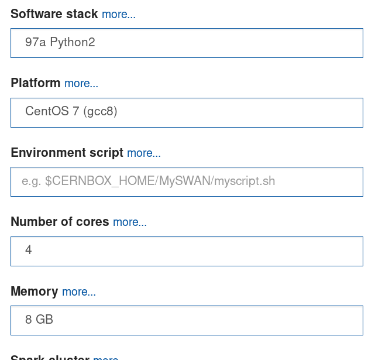
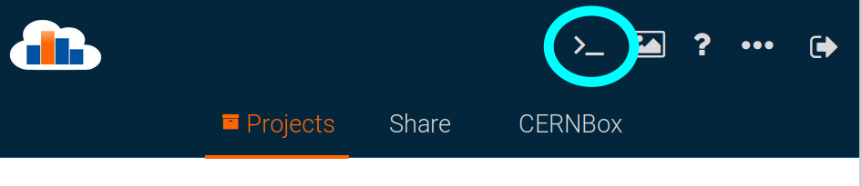

# Jet CMS DAS Exercise

## CMS DAS (virtual edition) September 2020
<summary>Directions for DAS September 2020</summary>
  
### Introduction
This tutorial is intended to provide you with the basic you need in order to deal with jets in your analysis. We start with the basics of what is a jet, how are they reconstructed, what algorithms are used, etc. Then we give examples with scripts on how to access jets and use them in your analysis frameworks, including corrections and systematics. In the second part of the exercise, we examine jet substructure algorithms, which have many uses including identification of hadronic decays of heavy SM particles like top quarks, W, Z, and H bosons, as well as mitigation of pileup and others.

We recommend two ways of following this tutorial: in lxplus or in SWAN. You do not need to follow both recipes below, use the one that you like the most.

## Run exercises in lxplus

If you Logging to lxplus and create a directory where your exercises are going to run. Then, do:

```bash
export SCRAM_ARCH=slc7_amd64_gcc700
cmsrel CMSSW_10_6_6
cd CMSSW_10_6_6/src
cmsenv
git clone https://github.com/cms-jet/JMEDAS.git Analysis/JMEDAS -b DASSep2020
git clone https://github.com/cms-jet/JetToolbox Analysis/JetToolbox -b jetToolbox_102X_v3
cd Analysis/JMEDAS
scram b -j 4
cd test
```

Now you are ready to continue with the exercises. Additionally, see the instructions on how to set your grid-certificate below.

## Run exercises in SWAN 

This version of the same tutorial uses Jupyer Notebooks as a browser-based development environment at [CERN-SWAN](https://swan.cern.ch). The content of these notebooks is the same as the one in lxplus, it is just a different set up.

### Getting Started (Setup)

Go to https://swan.cern.ch and log in with your CERN password. After that you need to configure your environment, please use these settings:



The most important configuration is the software stack, which has to be `97a Python2`. After that click on start the session.

Once you are in `My Projects`, create a new project by clicking on the plus icon on the right part of `My Projects`. Enter the project name you like, for this example we will use `CMSDAS_jetExercise`.

### Checkout the code
Open up a terminal by clicking on the icon:



Once there, you are in your cernbox home area, and you can follow these steps:

```
cd SWAN_projects/CMSDAS_jetExercise/
wget https://raw.githubusercontent.com/cms-jet/JMEDAS/DASSep2020/setup-libraries_SWAN.sh
source setup-libraries_SWAN.sh 
```
This will take a while, but basically you are setting your CMSSW environment, cloning some packages, and creating the kernel used in this exercises. If the compilation is succesful, you should see something similar to this at the end of the messages:
```
Loaded CMSSW_10_6_6 into hats-jec!
```
After this you can go to [`~/CMSDAS_jetExercise/DAS/`](notebooks/DAS/) and continue with the tutorial. The previous steps you have to _do it once_. Additionally, two important things:
 * You need to follow the instructions below to set your grid certificate. 
 * If you try to access any of the notebooks any other day, it will require you to confirm the kernel. For that please select the `hats-jec` option.


## Grid certificate

To access data stored remotely in different places, you need to set your grid certificate. 

 * *For lxplus*, you only need to runi (every time that you log in):
```bash
voms-proxy-init -voms cms -valid 192:00
```
 * *SWAN* still does not have a simple way of setting this certificate internally, but we can use a workaround. First, follow the instructions for the grid certificate in lxplus. Your certificate is located in something `/tmp/x509up_u0000`. Copy it to your cernbox area as:
```bash
cp /tmp/x509up_u0000 /eos/home-X/Y/    ### where X is the first letter of your cern user id, and Y is your cern user id.
```
Now you are ready to use your certificate in jupyter notebooks in SWAN. For this, in each notebook you need to run the cell with something similar than this:
```python
import os
os.environ['X509_USER_PROXY'] = '/eos/home-X/Y/x509up_u0000'  ### remember to change this line with what you did above
if os.path.isfile(os.environ['X509_USER_PROXY']): pass
else: print("os.environ['X509_USER_PROXY'] ",os.environ['X509_USER_PROXY'])
os.environ['X509_CERT_DIR'] = '/cvmfs/cms.cern.ch/grid/etc/grid-security/certificates'
os.environ['X509_VOMS_DIR'] = '/cvmfs/cms.cern.ch/grid/etc/grid-security/vomsdir'
```
_REMEMBER_ to do this every day that you will try to access remote files in SWAN.

## Tutorial
Once you've completed the setup instructions, change to the directory `~/CMSSW_10_6_6/src/Analysis/JMEDAS`. Information on the separate tutorial can be found in the "notebooks" subdirectory.

## Additional Information & Resources

  - [JERC Subgroup Twiki Page](https://twiki.cern.ch/twiki/bin/view/CMS/JetEnergyScale)
    - [JEC and JER Reference Sample Page](https://twiki.cern.ch/twiki/bin/view/CMS/JERCReference)
    - [WorkBook Page on Jet Energy Corrections](https://twiki.cern.ch/twiki/bin/view/CMSPublic/WorkBookJetEnergyCorrections?redirectedfrom=CMS.WorkBookJetEnergyCorrections)
    - [WorkBook Page on Jet Energy Resolution](https://twiki.cern.ch/twiki/bin/view/CMSPublic/WorkBookJetEnergyResolution)
  - [JetMET/JERC/JMAR Weekly Meetings](https://indico.cern.ch/categoryDisplay.py?categId=1308)
  - [Run2 Weekly Discussion Group](https://indico.cern.ch/category/7082/)
    - Every other week there is a meeting on jets and pileup
  - SQLite files, text files, and tarballs
    - [JEC Database](https://github.com/cms-jet/JECDatabase)
    - [JER Database](https://github.com/cms-jet/JRDatabase)
  - [JetToolbox Twiki Page](https://twiki.cern.ch/twiki/bin/view/CMS/JetToolbox)
  - [2017 MiniAOD Twiki Page](https://twiki.cern.ch/twiki/bin/view/CMSPublic/WorkBookMiniAOD2017)
