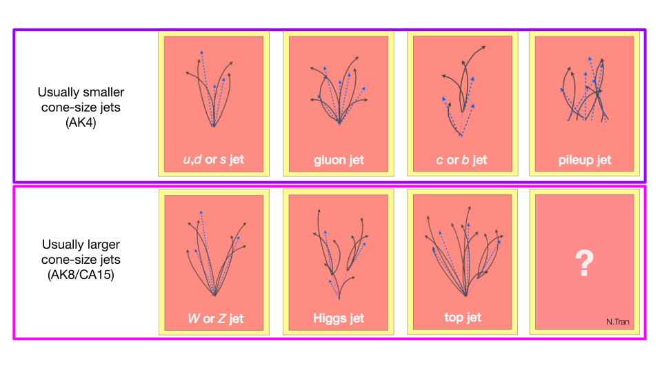
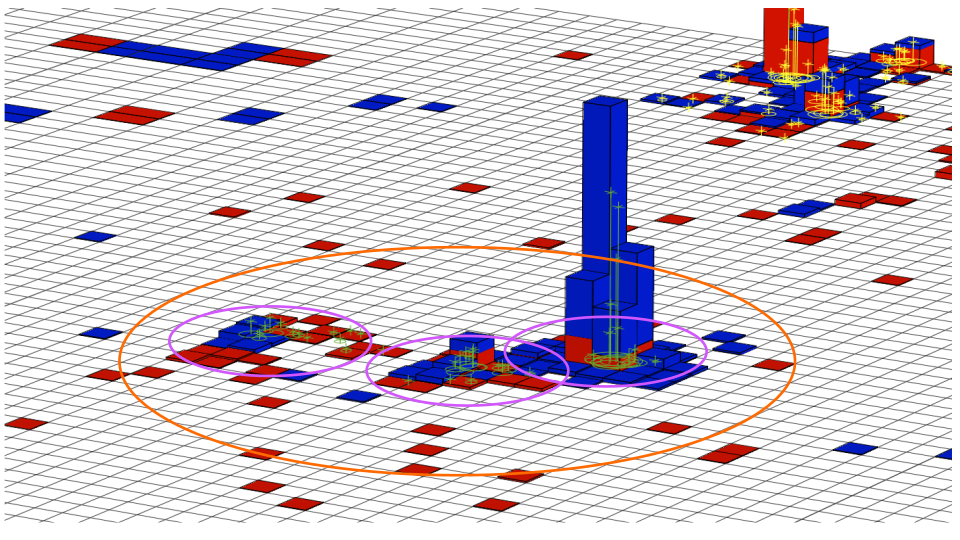
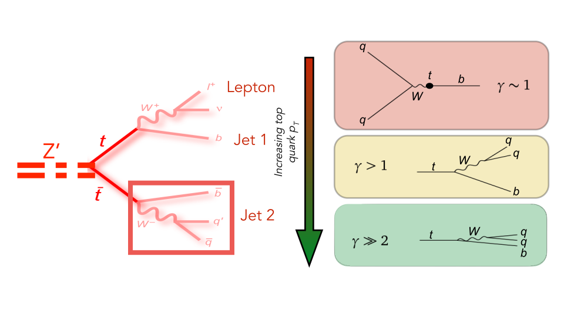
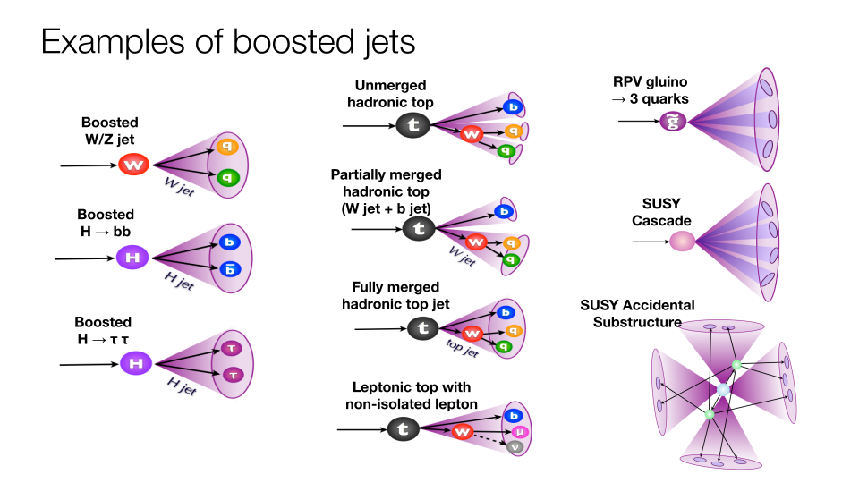

> ## After following the instructions in the setup:
>
> ~~~
> cd <YOUR WORKING DIRECTORY>/notebooks/DAS/
> source /cvmfs/sft.cern.ch/lcg/views/LCG_104/x86_64-centos7-gcc11-opt/setup.sh
> jupyter notebook --no-browser --port=8888 --ip 127.0.0.1
> ~~~
> {: .language-bash}
>
> This will open a jupyter notebook tree with various notebooks. 
{: .callout}

## What is a jet? 

In the previous episodes we discussed that the jet is a physical object representing the
hadronization of quakrs and gluons. Perhaps we have encounter that a jet can be formed from random
noise or pileup particles in our detectors, not necessarily coming from hard scattered quarks and
gluons, but jets can be so much more:

The internal structure of the jet constituents help us to understand their origin.

## Boosted Objects

Heavy particles which are created not at rest but with some momentum are referred as boosted
objects. Let's analyze the example of a top quark. If the top quarks are boosted, e.g. when coming from a new massive particle, what happens?. Hadronic decay products collimated so then they can be reconstructed in the same final-state object! Hadronic final states now become accessible with a dijet final state (in this case)

## Jet Substructure

Because boosted jets represent the hadronic products of a heavy particle produced with high momentum, some tools have been developed to study the internal structure of these jets. This topic is usually called Jet Substructure.

Jet substructure algorithms can be divided into three main tools:
 * **grooming algorithms** attempt to reduce the impact of *soft* contributions to clustering sequence by adding some other criteria. Examples of these algorimths are softdrop, trimming, pruning.
 * **subtructure variables** are observables that try to quantify how many cores or prongs can be identify within the structure of the boosted jet. Examples of these variables are n-subjetiness or energy correlation functions.
 * **taggers** are more sofisticated algorithms that attempt to identify the origin of the boosted jet. Currently taggers are based on sofisticated machine-learning techniques which try to use as much information as possible in order to efficiency identify boosted W/Z/Higgs/top jets. Examples of these taggers in CMS are deepAK8/ParticleNet or deepDoubleB.

For further reading, several measurements have been performed about jet substructure:
 * [Studies of jet mass in dijet and W/Z+jet events](http://arxiv.org/abs/1303.4811) (CMS).
 * [Jet mass and substructure of inclusive jets in sqrt(s) = 7 TeV pp collisions with the ATLAS experiment](http://arxiv.org/abs/1203.4606) (ATLAS).
 * [Theory slides](http://www.hri.res.in/~sangam/sangam18/talks/Marzani-2.pdf)
 * [More theory slides]( http://indico.hep.manchester.ac.uk/getFile.py/access?contribId=14&resId=0&materialId=slides&confId=4413)
 * [Talk from Phil Harris](https://web.pa.msu.edu/seminars/hep_seminars/abstracts/2018/Harris-HEPSeminar-Slides-4172018.pdf) on searching for boosted $W$ bosons.

 In this part of the tutorial, we will compare different subtructure algorithms as well as some usually subtructure variables.

> ## Open a notebook
>
> For this part, open the notebook called `Jet_Substructure.ipynb` and run Exercise 1.
{: .checklist}

> ## Question 4.1
> Look at the following histogram, which compares ungroomed, pruned, soft drop (SD), PUPPI, and
> SD+PUPPI jets. 
> 
> Note that the histogram has two peaks. What do these correspond to? How do the algorithms affect the relative size of the two populations?
{: .challenge}

## Substructure variables

> ## Open a notebook
>
> For this part, open the notebook called `Jet_Substructure.ipynb` and run Exercise 2.
{: .checklist}

In this exercise we are defining a few variables: nsubjetiness ratios (tau21, tau32) and energy correlation
functions (N2, N3).
Let's start with n-subjetiness ratios. The variable $\tau_N$ gives a sense of how many N prongs or cores can be find inside the jet. It is known that the n-subjetiness variables itself ($\tau_{N}$) do not provide good discrimination power, but its ratios do. Then, a $\tau_{MN} = \dfrac{\tau_M}{\tau_N}$ basically tests if the jet is more M-prong compared to N-prong. For instance, we expect 2 prongs for boosted jets originated from hadronic Ws, while we expect 1 prongs for high-pt jets from QCD multijet processes. The most common nsubjetiness ratio are $\tau_{21}$ and $\tau_{32}$. 

> ## Question 4.2
> Look at the histogram comparing $\tau_{21}$. What can you say about the histogram? Is $\tau_{21}$ telling you something about the nature of the boosted jets selected?
{: .challenge}

> ## Question 4.3
> Look at the histogram comparing $\tau_{32}$. What can you say about the histogram? Is $\tau_{32}$ telling you something about the nature of the boosted jets selected?
{: .challenge}

Another subtructure variable commonly used is the energy correlation function $N2$. Similarly than $\tau_{21}$, $N2$ tests if the boosted jet is compatible with a 2-prong jet hypothesis.

> ## Question 4.4
> Look at the histograms comparing $N2$ and $N3. What can you say about the histogram? Are these variables telling you something about the nature of the boosted jets selected?
{: .challenge}

### Rho parameter

A useful variable for massive, fat jets is the QCD scaling parameter $\rho$, defined as:

$\rho=\log(m^2/(p_{\mathrm{T}}R)^2)$.

(Sometimes $\rho$ is defined without the log). One useful feature of this variable is that QCD jet mass grows with $p_{\mathrm{T}}$, i.e. the two quantities are strongly correlated, while $\rho$ is much less correlated with $p_{\mathrm{T}}$.

> ## Open a notebook
>
> For this part, open the notebook called `Jet_Substructure.ipynb` and run Exercise 3.
{: .checklist}

> ## Question 4.5
> After running Exercise 3, in which cases do you think the $\rho$ variable can be used? 
{: .challenge}

> ## Solution 4.5
> The following two plots show what QCD events look like in different $p_{T}$ ranges. It's clear that the mass depends very strongly on $p_{T}$, while the $\rho$ shape is fairly constant vs. $p_{T}$ (ignoring $\rho<7$ or so, which is the non-perturbative region). Having a stable shape is useful when studying QCD across a wide $p_{T}$ range.
> 
> 
{: .solution}

## Jet mass

We can also use jet mass to distinguish our boosted W and top jets from QCD. Let's compare the AK8 jet mass of the boosted top quarks from the RS KK sample and the jets from the QCD sample. Let's also look at the and the softdrop groomed jet mass combined with the PUPPI pileup subtraction algorithm for different samples.

> ## Open a notebook
>
> For this part, open the notebook called `Jet_Substructure.ipynb` and run Exercise 4.
{: .checklist}

> ## Question 4.6
>
> Do you think the jet softdrop mass alone can be used to identify boosted W and top jets? 
{: .challenge}

## W and top tagging

In this part of the tutorial, we will look at how different substructure algorithms can be used to identify jets originating from boosted W's and tops. Specifically, we'll see how these identification tools are used to separate these boosted jets from those originating from Standard Model QCD, a dominant process at the LHC.

### W tagging

We will now investigate how to identify W bosons using the substructure techniques we've learned.
Compare the tau2 / tau1 ratio for the AK8 jets from Standard Model top quarks to those from the QCD samples. 

> ## Open a notebook
>
> For this part, open the notebook called `Jet_Substructure.ipynb` and run Exercise 5.
{: .checklist}

> ## Question 4.7
>
> * Why can we use a ttbar sample to talk about W-tagging?
> * What cuts would you place on these variables to distinguish W bosons from QCD?
> * So far, which variable looks more promising?
{: .challenge}

### top tagging

We will now investigate how to identify top quarks using the substructure techniques we've learned.

> ## Open a notebook
>
> For this part, open the notebook called `Jet_Substructure.ipynb` and run Exercise 6.
{: .checklist}

> ## Question 4.8
> * What cut would you apply to select boosted top quarks?
> * For both the W and top selections, what other variable(s) could we cut on in addition?
{: .challenge}

### Go Further

 * You can learn more about jet grooming from the jet substructure exercise and PUPPI from the pileup mitigation exercise.
 * We briefly mentioned that you can combine variables for even better discrimination. In CMS, we do this to build our jet taggers. For the simple taggers, we often combine cuts on jet substructure variables and jet mass. The more sophisticated taggers, which are used more and more widely within CMS, use deep neural networks. To learn about building a machine learning tagger, check out the [machine learning short exercise](https://twiki.cern.ch/twiki/bin/view/CMS/SWGuideCMSDataAnalysisSchoolCERN2020MLShortExercise). (FIXME)

> ## What about boosted Higgs?
>
> CMS has also a rich program for booted Higgs to bb/cc taggers, however they are usually studied by
> the btagging group (BTV). Look at their documentation for more information.
{: .callout}



