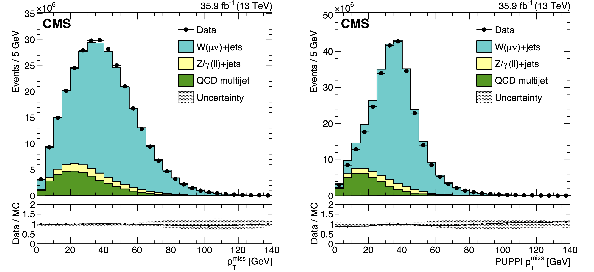

> ## After following the instructions in the jets exercise setup, make sure you have the CMS environment and create the symbolic link to MET analyzer:
>
> ~~~
> cd $CMSSW_BASE/src/Analysis
> cmsenv
> ~~~
> {: .language-bash}
{: .callout}

## Event Reconstruction

Event reconstruction in CMS is achieved using the Particle Flow (PF) algorithm, which integrates information from all CMS subdetectors to reconstruct individual particles.
The algorithm produces a list of PF candidates classified as electrons, photons, muons, neutral hadrons, or charged hadrons.
These PF candidates are then used to reconstruct high-level physics objects, including jets and missing transverse momentum (MET).

<figure>
  
  <center><figcaption>Schematic of the CMS particle flow reconstruction algorithm.</figcaption></center>
</figure>

## Missing Transverse Energy

MET quantifies the imbalance in the transverse momentum of all visible particles in the final state of collisions—those interacting via electromagnetic or strong forces.
Due to momentum conservation in the transverse plane (the plane perpendicular to the beam), MET reflects the transverse momentum carried by undetected weakly interacting particles, such as neutrinos or potential dark matter candidates.
Although these invisible particles leave no direct signature in the CMS detector, their presence is inferred from the observed net momentum imbalance in the event.

An example of event with MET is shown in the figure below where two top quarks are produced. Each top quark decays into a b-jet and a W boson. The leptonic decay of a W boson leads to a lepton and its corresponding neutrino. So, the final state contains two jets, two leptons and missing transverse energy from two neutrinos.

<figure>
  
  <center><figcaption>Event display of a ttbar event recorded by CMS shows the dileptonic decay channel with two jets, one electron, one muon, and missing transverse energy from two neutneutrinosrinoes.</figcaption></center>
</figure>

MET is a vital variable in many CMS analyses, playing a key role in both Standard Model measurements and Beyond Standard Model searches.
In the Standard Model, MET is used to study processes involving neutrinos in the final state, such as the W boson mass measurement.
In searches for new physics, MET helps identify potential signatures where weakly interacting particles escape detection, such as dark matter, resulting in an imbalance in transverse momentum.

The images below illustrate two such cases: on the left, a candidate W boson event with $W \rightarrow \mu \nu$, used in the W mass measurement, and on the right, a candidate event for dark matter production, featuring a hard jet recoiling against large missing energy.

<div style="display: flex; justify-content: center; align-items: center;">
  <figure style="margin: 0 5px; text-align: center;">
    
    <figcaption>W boson candidate event with a muon and neutrino.</figcaption>
  </figure>
  <figure style="margin: 0 5px; text-align: center;">
    
    <figcaption>Dark matter search event with a hard jet recoiling against large MET.</figcaption>
  </figure>
</div>
<p style="text-align: center;">Event displays of analyses involving MET.</p>


### Raw PF MET

The most widely used MET reconstruction algorithm in CMS is the PF MET.
PF MET is reconstructed as the negative vector sum of the pT of all PF candidates in the event, which is summarized in the following equation:


$$\textrm{PF}~\vec{p}_{T}^{~miss} = - \sum_{i \in all~PF~Cands} \vec{p}_{T, i}$$

This is also known as the "raw" PF MET.

### Raw PUPPI MET

Multiple simultaneous proton-proton collisions occurring in the same bunch crossing, referred to as pileup, adversely affect MET resolution, leading to poorer performance at higher pileup levels. To mitigate these effects and improve MET performance with respect to pileup, CMS employs an alternative reconstruction algorithm known as PUPPI MET.


The PUPPI (Pileup Per Particle Identification) algorithm applies inherently local corrections by leveraging specific properties of particles. Particles originating from the hard scatter process are typically geometrically close to other particles from the same interaction and generally exhibit higher pT. In contrast, pileup particles lack shower structures, have lower pT on average, and are uncorrelated with particles from the leading vertex.


Using this information, the PUPPI algorithm removes charged particles associated with pileup vertices and assigns weights (ranging between 0 and 1) to neutral particles based on their likelihood of originating from pileup, thus enhancing MET reconstruction in high-pileup environments. The PUPPI MET is calculated using particle weights and can be summarized in the following equation:


$$\textrm{PUPPI}~\vec{p}_{T}^{~miss} = - \sum_{i \in all~PF~Cands} w_i~\vec{p}_{T, i}$$


The figure below presents the MET distribution for both PF MET and PUPPI MET in events with leptonically decaying W bosons, demonstrating the improved performance achieved with PUPPI MET.



> ## Remember
> PUPPI MET is the default MET algorithm in Run~3.
{: .callout}


## Exercise 1
The goal of this part is to get familiar:
- with the event content of the miniAOD data tier,
- the MET collections stored by default in miniAOD,
- how to use tools to easily browse through the miniAOD file.

The file used for in part contains simulated events ([/DYJetsToLL_M-50_TuneCP5_13TeV-amcatnloFXFX-pythia8/RunIISummer19UL18MiniAOD-106X_upgrade2018_realistic_v11_L1v1-v2/MINIAODSIM](https://cmsweb.cern.ch/das/request?input=dataset%3D%2FDYJetsToLL_M-50_TuneCP5_13TeV-amcatnloFXFX-pythia8%2FRunIISummer19UL18MiniAOD-106X_upgrade2018_realistic_v11_L1v1-v2%2FMINIAODSIM&instance=prod/global)), but the same conclusions hold for data files.

To view the event content of a miniAOD file one can use the `edmDumpEventContent` command and since we are interested in the MET collections only we use `grep` to avoid long printouts.

~~~
edmDumpEventContent root://eosuser.cern.ch//eos/user/c/cmsdas/2025/MET/DYJetsToLL_M50_amcatnloFXFX.root | grep MET
~~~
{: .language-bash}


> ## Question 1
> What MET collections do you see inside a MiniAOD file?
{: .challenge}

> ## Solution 1
> The output is:
> ```
> vector<pat::MET>                      "slimmedMETs"               ""                "PAT"        
> vector<pat::MET>                      "slimmedMETsNoHF"           ""                "PAT"        
> vector<pat::MET>                      "slimmedMETsPuppi"          ""                "PAT"        
> ```
> Each entry (line) corresponds to a separate MET collection.
> The first column, `pat::MET`, shows the class of the MET object, where one finds the properties of the MET object.
> The second column shows the MET collection, and finally PAT is the namespace (in MiniAOD it is PAT).
>
> In this exercise we will focus on the `slimmedMETs` and `slimmedMETsPuppi` collections.
{: .solution}




