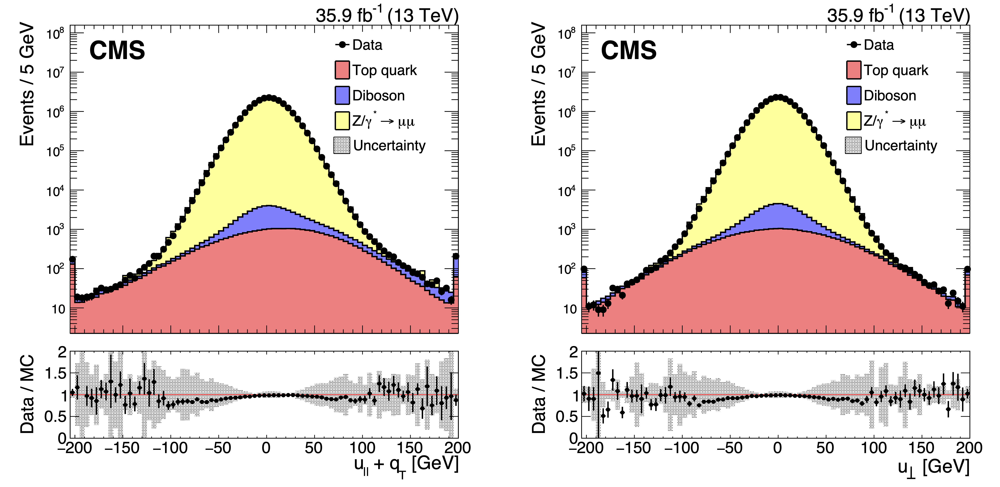

> ## After following the instructions in the setup, make sure you have the CMS environment:
>
> ~~~
> cd $CMSSW_BASE/src/Analysis
> cmsenv
> ~~~
> {: .language-bash}
{: .callout}

## MET performance

A well-measured Z boson or photon provides a unique event axis and a precise momentum scale for evaluating MET performance.
To achieve this, the response and resolution of MET are studied in samples where a Z boson decays to a pair of electrons or muons, or in events with an isolated photon.
**Such events should have little to no genuine MET.**

The MET performance is then assessed by comparing the momentum of the vector boson to that of the hadronic recoil system.
The hadronic recoil system is defined as the vector sum of the transverse momenta of all PF candidates, excluding the vector boson (or its decay products in the case of Z boson decay).

Momentum conservation in the transverse plane imposes

$$\vec{q}_{T} + \vec{u}_{T} + \vec{p}_{T}^{miss} =0$$,

where $$\vec{q}_{T}$$ is the transverse momentum of the Z boson, and $$\vec{u}_{T}$$ is the hadronic recoil.

Define two components of the hadronic recoil to study the MET response and resolution:
- hadronic recoil parallel ($$u_{\parallel}$$) to the boson axis: sensitive to the scale of boson/jets
- perpendicular ($$u_{\perp}$$) to the boson axis: sensitive to isotropic effects like pileup

Specifically, the mean of the distribution of the magnitude of $$q_{T} + u_{\parallel}$$, is used to estimate the MET response, whereas the RMS of $$q_{T} + u_{\parallel}$$ and $$u_{\perp}$$ distributions are used to estimate the MET resolution in the axis parallel and perpendicular to the Z boson, respectively. 

An example of the $$q_{T} + u_{\parallel}$$ and $u_{\perp}$ distributions is shown in the following plots.

Use the distribution of the parallel and perpendicular components of the hadronic recoil to measure the MET scale and resolution
- Get the mean of the parallel component to estimate MET scale.
- The RMS of the distributions gives the MET resolution in each direction.

## Exercise 3.1: MET Scale

In this exercise, we will measure the scale of the "uncorrected" (raw) PF MET as a function of the transverse momentum of the Z boson (pT(Z)).

To start, run the following commands:
~~~
cd $CMSSW_BASE/src/Analysis/JMEDAS/scripts
root -l -q 'cmsdasmetplotsexercise3.C("step3_scale_pfraw")'
~~~
{: .language-bash}

> ## Question 3.1 (a)
> For a fully calibrated MET object, what behavior would you expect to see in the distribution?
{: .challenge}

> ## Solution 3.1 (a)
> 
> For a fully calibrated MET object, the scale is expected to be approximately 1, indicating an accurate representation of the true missing transverse energy with minimal systematic bias.
{: .solution}

Next, measure the MET scale using the Type-1 calibrated MET. Run the following commands:
~~~
cd $CMSSW_BASE/src/Analysis/JMEDAS/scripts
root -l -q 'cmsdasmetplotsexercise3.C("step3_scale_pftype1")'
~~~
{: .language-bash}

> ## Question 3.1 (b)
> Compare the distributions of "Raw" and "Type-1" PF MET. Do you understand why there is a "turn-on" effect for Type-1 PFMET?
{: .challenge}

> ## Solution 3.1 (b)
> 
{: .solution}

---

## Exercise 3.2: MET Resolution

Now, let’s analyze the resolution of MET as a function of pT(Z) and the number of pileup vertices. To do this, run:
~~~
cd $CMSSW_BASE/src/Analysis/JMEDAS/scripts
root -l -q 'cmsdasmetplotsexercise3.C("step3_resolution_pftype1")'
~~~
{: .language-bash}

This command will generate distributions showing the resolution of the parallel ($u_{\parallel}$) and perpendicular ($u_{\perp}$) components of MET with respect to pT(Z) and pileup. 

> ## Question 3.2
> How does the MET resolution depend on pileup?
{: .challenge}

> ## Solution 3.2
> The MET resolution degrades significantly as pileup increases, with an average deterioration of approximately 4 GeV per additional pileup vertex.
>
>  

>  <figure style="margin: 0; text-align: center; width: 45%;">
>    
>  </figure>
>  <figure style="margin: 0; text-align: center; width: 45%;">
>    
>  </figure>
>  <figure style="margin: 0; text-align: center; width: 45%;">
>    
>  </figure>
>  <figure style="margin: 0; text-align: center; width: 45%;">
>    
>  </figure>
>  

{: .solution}

For more detailed insights, refer to the CMS MET paper based on 13 TeV data: [CMS-JME-17-001](https://arxiv.org/abs/1903.06078).

## Exercise 3.3
Equipped with the ability to evaluate MET performance through scale and resolution, we now aim to compare Type-1 PF MET with Type-1 PUPPI MET. **Starting from Run 3, Type-1 PUPPI MET is the default MET algorithm in CMS.** In this example, we will examine the performance of PF MET and PUPPI MET by comparing their scale and resolution.

To generate the corresponding plots, use the following command:
~~~
cd $CMSSW_BASE/src/Analysis/JMEDAS/scripts
root -l -q 'cmsdasmetplotsexercise4.C'
~~~
{: .language-bash}

This might take a few minutes to process.

> ## Question 3.3 (a)
> Compare the correlation between Type1 PFMET and Puppi MET. What do you observe?
{: .challenge}

> ## Solution 3.3 (a)
> 
{: .solution}

> ## Question 3.3 (b)
> Compare the scale and resolution between Type1 PFMET and Puppi MET, especially the resolution as a function of $$N_{vtx}$$. What do you observe?
{: .challenge}

> ## Solution 3.3 (b)
> Significantly improved MET resolution as a function of $$N_{vtx}$$ compared to PFMET.
> PUPPI-MET has 2x smaller degradation in resolution compared to PFMET.
>
>  

>  <figure style="margin: 0; text-align: center; width: 45%;">
>    
>  </figure>
>  <figure style="margin: 0; text-align: center; width: 45%;">
>    
>  </figure>
>  <figure style="margin: 0; text-align: center; width: 45%;">
>    
>  </figure>
>  <figure style="margin: 0; text-align: center; width: 45%;">
>    
>  </figure>
>  

{: .solution}



