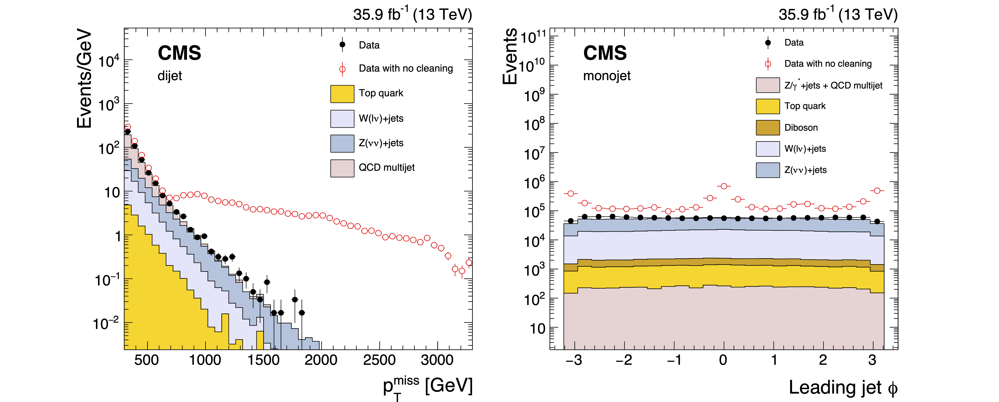

> ## After following the instructions in the setup, make sure you have the CMS environment:
>
> ~~~
> cd $CMSSW_BASE/src/Analysis
> cmsenv
> ~~~
> {: .language-bash}
{: .callout}

## What is anomalous MET? 

Anomalous MET refers to events where the measured MET deviates from what is expected due to various factors, such as reconstruction failures, detector malfunctions, or background noise.
These anomalous MET events can arise from:
- **Detector Issues:** Malfunctions or mismeasurements in detectors, such as the electromagnetic calorimeter (ECAL) or hadronic calorimeter (HCAL), leading to spurious energy deposits.
- **Reconstruction Failures:** Errors in reconstructing particle tracks or energy, including issues with jets, leptons, or unclustered energy, that result in inaccurate MET calculations.
- **Non-collision Origins:** Spurious signals from sources unrelated to the particle collision, such as beam-halo particles, cosmic rays, or other environmental factors.
- **Dead or Malfunctioning Detector Cells:** Areas of the detector that fail to register energy deposits correctly, leading to underestimation of the MET.

In such events, the MET value may be much higher than expected and does not reflect true missing energy from invisible particles (like neutrinos or dark matter candidates).

<figure>
  
  <center><figcaption> An example of identifying the source of anomalous MET.</figcaption></center>
</figure>

## Noisy event filters

To identify false MET, several algorithms have been developed that analyze factors such as timing, pulse shape, and signal topology.
When fake MET is detected, the corresponding events are typically discarded.
These cleaning algorithms, or filters, run in separate processing paths, and the outcome (success or failure) is recorded as a filter decision bit.
Analyzers can use this decision bit to filter out noisy events. These filters are specifically designed to reject events with unusually large MET values caused by spurious signals.

<figure>
  
  <center><figcaption> MET $p_T$ and leading jet $\phi$ distributions, with and without the application of event filters.</figcaption></center>
</figure>


## Excercise 4

Noisy event filters (previously called MET Filters) are stored as trigger results, specifically in edm::TriggerResults of the RECO or PAT process. Each MET filter runs in a separate path, and the success or failure of the path is recorded as a filter decision bit. For more information, please refer to the provided [link](https://twiki.cern.ch/twiki/bin/viewauth/CMS/MissingETOptionalFiltersRun2).

In this exercise, we will show how to access the MET Filters in miniAOD. Please run the following commands:
~~~
cd $CMSSW_BASE/src/Analysis/JMEDAS
cmsRun test/run_CMSDAS_MET_Exercise4_cfg.py
~~~
{: .language-bash}

This example accesses the decision bits for the following MET Filters: `Beam Halo`, `HBHE`, `HBHE (Iso)`, `Ecal Trigger Primitives`, `EE SuperCluster`, `Bad Charged Hadron`, and `Bad PF Muon`. A "true" decision means the event was not rejected by the filter. The analyzer used in this example is `JMEDAS/plugins/CMSDAS_MET_AnalysisExercise5.cc`. The printed result will look like this:

```
Begin processing the 1st record. Run 317626, Event 178458435, LumiSection 134 on stream 0 at 28-Jun-2020 10:39:20.656 CDT
MET Filters decision:
 HBHE = 1
 HBHE (Iso) = 1
 Beam Halo = 1
 Ecal TP = 1
 EE SuperCluster = 1
 Bad Charged Hadron = 1
 Bad PF Muon = 1
.......
.......
```

> ## Question 4
> To see the output for a bad event, modify the input file in `JMEDAS/test/run_CMSDAS_MET_Exercise4_cfg.py`.
> Comment out the line for the first input file `cmsdas_met_METFilters1.root` and uncomment the line for the second input file `cmsdas_met_METFilters2.root`.
> Then run the code again. What changes do you notice?
{: .challenge}

> ## Solution 4
> The event does not pass the `HBHE` filter and for an event to qualify it must pass **ALL** filters.
> ```
> Begin processing the 1st record. Run 317182, Event 1740596074, LumiSection 1226 on stream 0 at 06-Jan-2025 08:22:50.035 CST
> MET Filters decision: 
>  HBHE = 0
>  HBHE (Iso) = 1
>  Beam Halo = 1
>  Ecal TP = 1
>  EE SuperCluster = 1
>  Bad Charged Hadron = 1
>  Bad PF Muon = 1
>  .......
>  .......
> ```
{: .solution}




