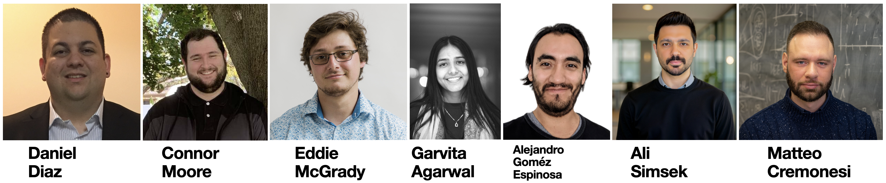

This tutorial will give you the basics you need to deal with jets in your analysis. We start with the basics of a jet, how they are reconstructed, what algorithms are used, etc. Then, we give examples with scripts on how to access jets and use them in your analysis frameworks, including corrections and systematics. In the second part of the exercise, we examine jet substructure algorithms, which have many uses, including the identification of hadronic decays of heavy SM particles like top quarks, W, Z, and H bosons, as well as mitigation of pileup and others.

The tutorial is designed to be executed at cmslpc, following the setup step, using jupyter notebooks. On this website, you will find links to instructional slides and more information about the topics to walk you through the exercises.

_For general questions, problems, debugs, or asking for help from experts on jets and missing ET:_ [CMS Talk JetMET category](https://cms-talk.web.cern.ch/c/pog/jetmet/51)

_Follow the CMS workbook on jet analysis:_ [WorkBookJetAnalysis](https://twiki.cern.ch/twiki/bin/view/CMSPublic/WorkBookJetAnalysis)

> ## What is this set of exercises trying to do?
>
>It gives you hands-on experience accessing jet collection in an event, plotting basic jet quantities, and applying jet energy correction.
> * This is a 101 on accessing jets in the CMS framework without assuming prior knowledge of jet analysis.
> * Make you familiar with basic jet types and algorithms and how to use them in your analysis.
> * Illustrate each exercise using real-life example scripts.
> * Give a comprehensive reference to more advanced workbook examples, additional resources, and pedagogical documentation in one place.
{: .objectives}

> ## What are these exercises NOT meant for?
>
> To summarize the CMS JetMET software machinery comprehensively or the jet analyses performed at CMS.
{: .keypoints}

> ## What do we expect from you?
>
> * You should have followed all the pre-exercises and have a cmslpc account, grid certificate, and a current web browser.
> * It would be best if you worked through the notebooks, ensuring you understand every step and every plot.
> * The exercises are prepared to be run directly from a cmslpc node, with non-interactive notebooks to follow and discuss the exercises.
{: .testimonial}

### Facilitators CMSDAS LPC 2025

### Support

Join the [ShortExJets Mattermost channel](https://mattermost.web.cern.ch/cmsdaslpc2024/channels/shortexjets) and don't hesitate to ask for help from the facilitators in the room.

<!-- this is an html comment -->
 This is a comment in Liquid 

> ## Prerequisites
>
> [CMS DAS Pre-exercises](https://fnallpc.github.io/cms-das-pre-exercises/) 
{: .prereq}


